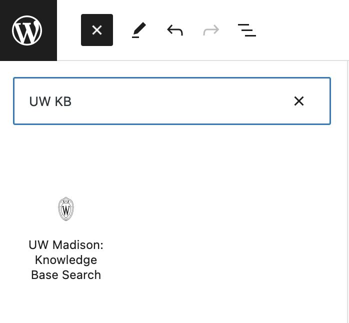
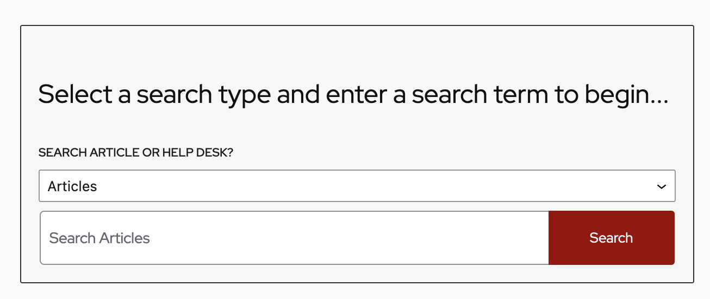
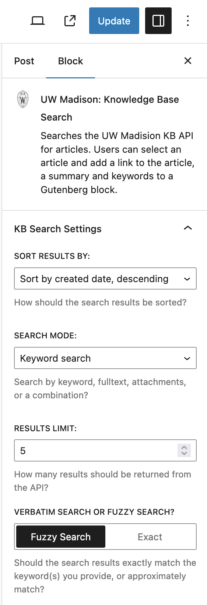
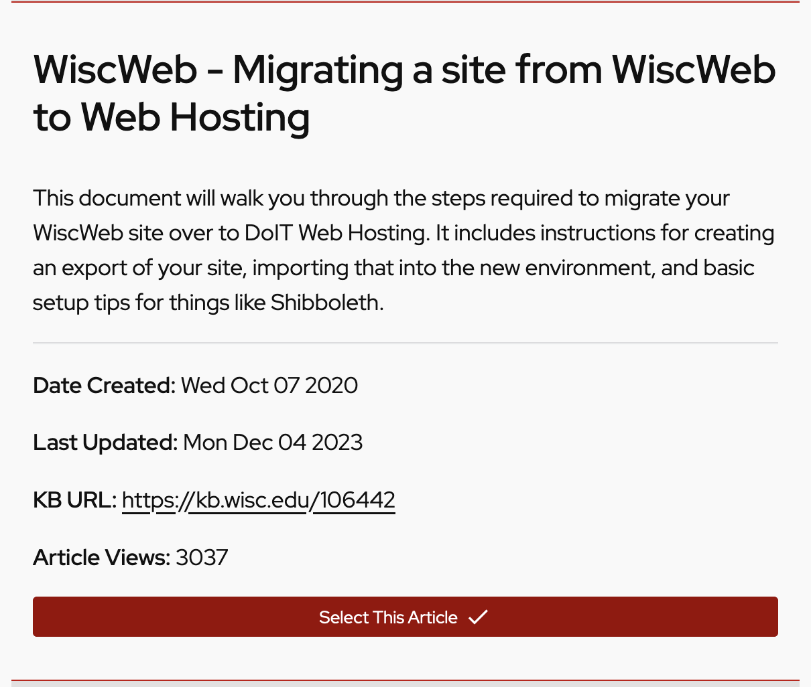
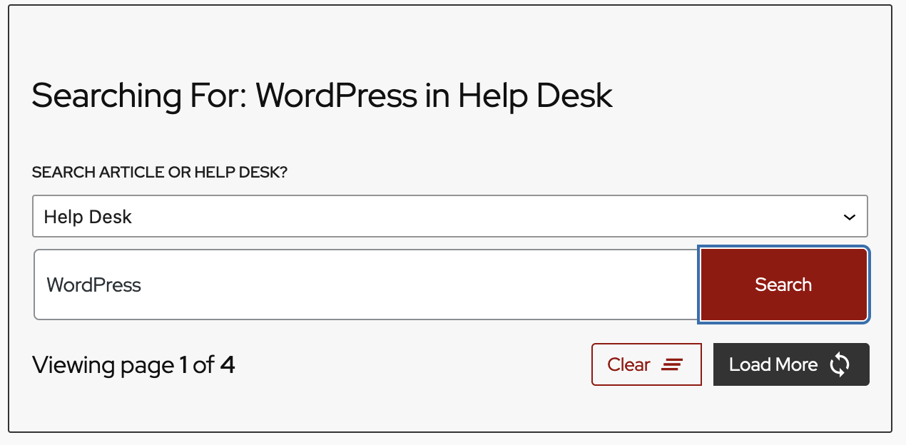
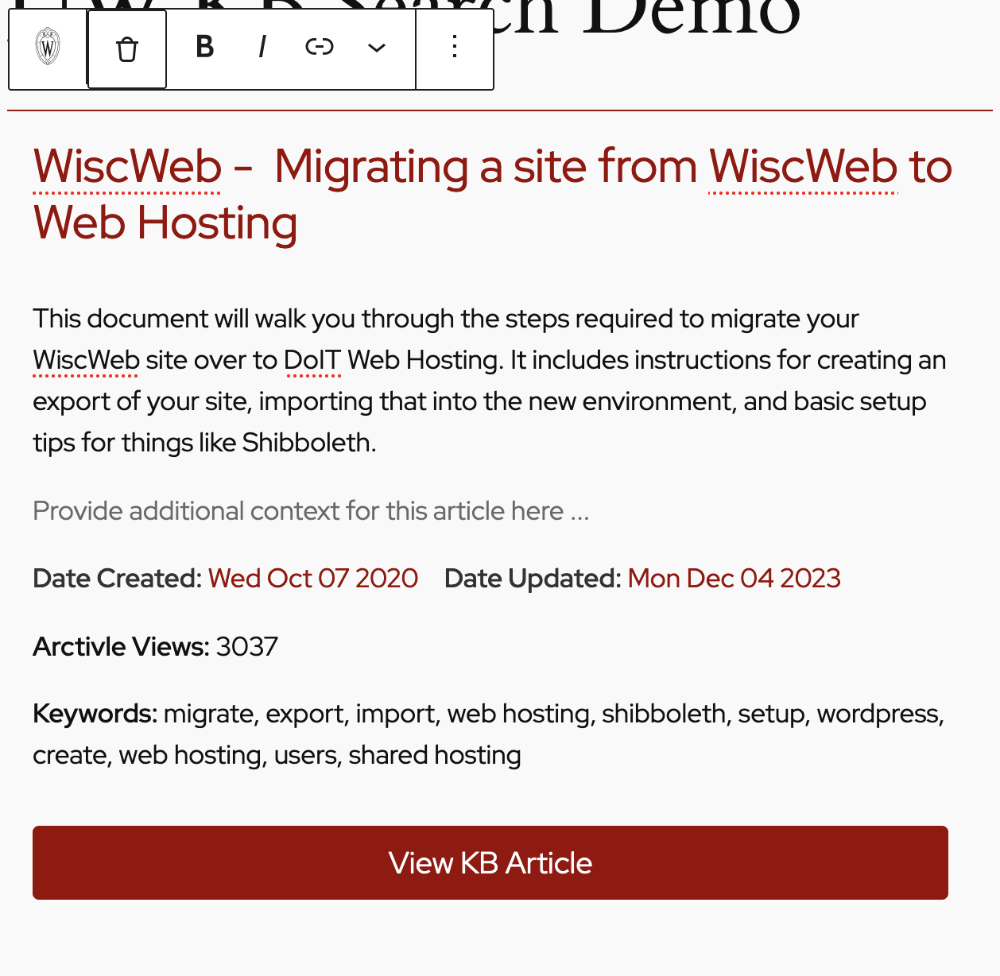

# UW KB Search

## About This Plugin

This plugin adds a Gutenberg block that allows users to search the University of Wisconsin - Madison [Knowledge Base](https://kb.wisc.edu/) (KB) for an article or a help desk article, then select and add the article as a preformatted block in a page or a post. 

## Plugin Installation 
1. Download or clone this plugin to your computer. Do not unzip the file.
2. In the WordPress admin area navigate to the "Plugins" page.
3. Click the "Add New" button, which will take you to the "Add Plugins" page.
4. Click "choose file" and navigate to the location of the zipped plugin file on your computer.
5. Click the "Install Now" button.
6. Once the plugin has been installed, click "Activate" to activate the plugin.

## Usage 

Instructions on how to add a KB search block, configure search options, and add an article follow below. If you prefer, you can [watch a screencast demonstrating the plugin via this link.](https://go.screenpal.com/watch/cZeToqV7HXj)

1. Add a KB Search block to a page or post via the block inspector in the top left side of the editor. Click on the **UW Madison: Knowledge Base Search tile** to add the block. 
   

2. The block has a few different states. The default state is the search form. The form contains a select element where you can choose to search the **KB Help Desk API** or the **KB Articles API**. 

 

3. On the right side of the screen, in the **Block Inspector** you can configure different options for your API search. 

Search options include:

| Option Name | Description | Default |
| --- | --- | --- |
| Sort | How should the search results be sorted.| Title, desc. |
| Mode | Do you want to search by Keyword, Fulltext, Attachments, or a combination?| Keyword | 
| Limit | How many results should the API return per page? | 5 results per page |
| Verbatim (Exact) or Fuzzy Search | Return results containing the exact word or phrase entered into the search input? Or return results that match some of the word or phrase? | Fuzzy |

For more information on these options please review [the KB API documentation.](https://kb.wisc.edu/kbGuide/page.php?id=69510)

4. If the API returns a results set the block will populate a list of returned results below the search form. 

The API data outputted on the frontend includes:
- The article title
- A summary of the full article
- The date the article was created
- The date the article was last updated
- A URL to the full article
- The number of views the article has receieved to date

If the API has additional pages of results the search form will display pagination options and information.

You can clear the state of the search results, and any configuration you adjusted in the block inspector via the "Clear" button. You can iterate through each additional page of results by clicking the "Load More" button. 

5. Select an article by clicking the "Select This Article" button in any of the returned results. This will clear the search form and results, remove any configuration from the block state, and load a preview of the selected article into the block. 

The selected article has some editable elements. The title and summary returned from the API can be edited - they are rich text Gutenberg components. You can also provide additional information in the "additional context" rich text components below the summary. 

To remove the selected block and reload the search form click the **trash can icon** in the Block Controls bar directly above the selected block.

To save the block click the update button on the top right of the page or post. If you don't save the block in the "selected article" state the block will default back to the search form when you reload the editor. 

## Notes

- This plugin was built to explore Gutenberg block development and work with the KB API. This is not meant to be used in production at this time. 
- Feedback and user testing is very much appreciated. Please create an issue for this repository if you find any bugs, have any thoughts on improvements, or have any feature requests.
- The KB API sometimes returns raw HTML in the title or summary for search results. Due to this I made the decision to make the title and summary for the selected article component rich text editors that allow for editing the content returned from the API. 
